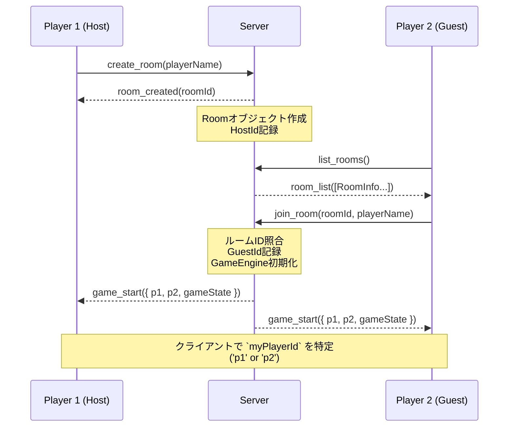
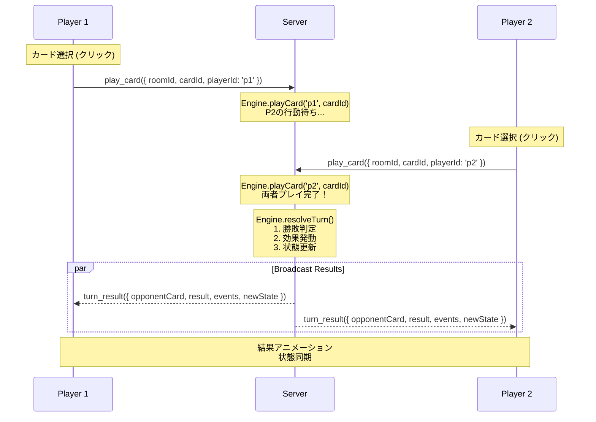
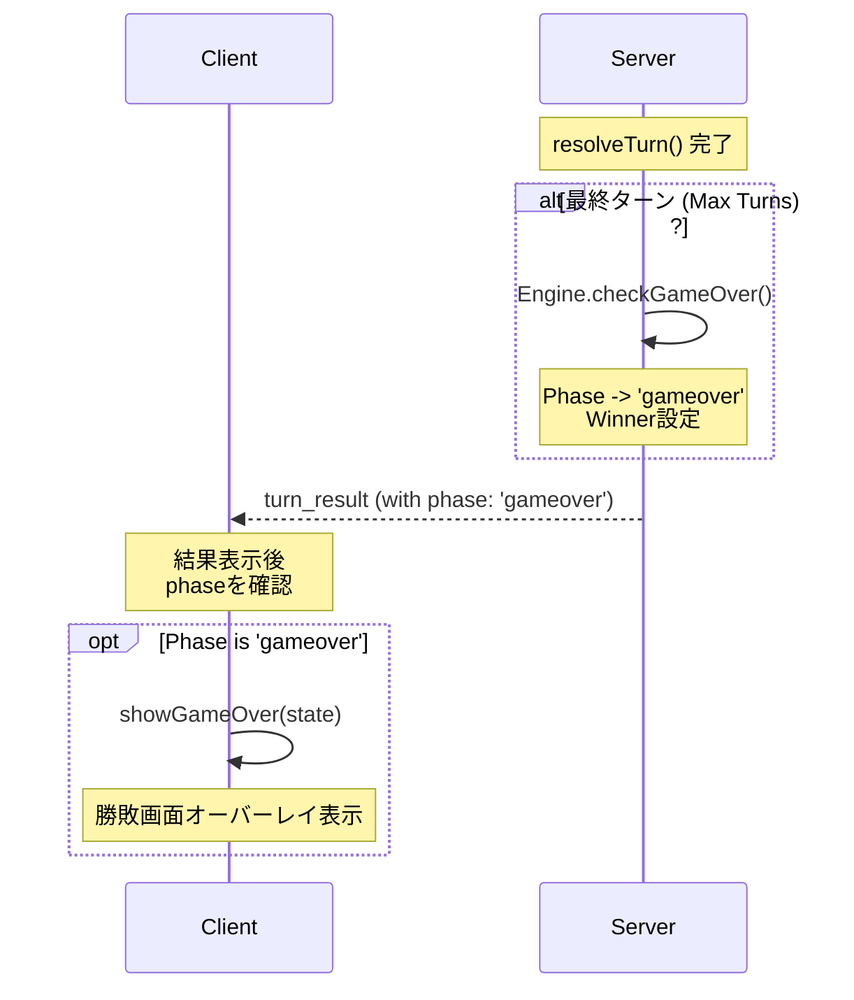

# PvP アーキテクチャと通信フロー

## 1. 全体アーキテクチャ

本アプリケーションのPvP機能は、Docker環境上で動作するクライアント・サーバーモデルを採用しています。

### コンテナ構成
- **app (Client)**: Vite + TypeScriptで動作するフロントエンド。ポート5173。
- **server (Backend)**: Node.js + Socket.IOで動作するバックエンド。ポート3000。
- **Shared Core**: ゲームロジック（`src/core`）は両コンテナ間で共有（Docker Volumeマウント）されており、ロジックの二重管理を防いでいます。

```mermaid
graph LR
    User[ユーザー] --> App[App Container (Client)]
    App -- Socket.IO (ws://localhost:3000) --> Server[Server Container (Backend)]
    
    subgraph Docker Environment
        App
        Server
        Core[Shared Core Logic (src/core)]
        App -.-> Core
        Server -.-> Core
    end
```

## 2. モジュール構成

### クライアントサイド (`src/`)
- **`main.ts`**: UI操作、ゲーム進行のメインループ、SocketClientの呼び出し。
- **`core/server/socket_client.ts`**: Socket.IO通信のラッパー。`ServerAPI` インターフェースを実装し、通信詳細を隠蔽。

### サーバーサイド (`server/src/`)
- **`index.ts`**: エントリポイント。ルーム管理、Socketイベントのハンドリング、GameEngineの実行を担当。

### 共通ロジック (`src/core/`)
- **`engine.ts`**: `GameEngine` クラス。カード効果の適用、勝敗判定、状態遷移を行う純粋なTypeScriptロジック。
- **`types.ts`**: ゲームの状態 (`GameState`) やカードIDなどの型定義。

## 3. 通信フロー

### 3.1 ルーム作成と参加



### 3.2 ターン進行 (カードプレイ)

以下のフローは、プレイヤーがカードを選択してから、結果が表示されるまでの流れです。



### 3.3 ゲーム終了判定



## 4. データ構造

### GameState
```typescript
interface GameState {
  turn: number;          // 現在のターン数
  phase: 'selection' | 'resolution' | 'gameover';
  players: {
    p1: PlayerState;
    p2: PlayerState;
  };
  winner: PlayerId | 'draw' | null;
}
```

### TurnResponse (サーバーからのレスポンス)
```typescript
interface TurnResponse {
  opponentCard: CardId;      // 相手が出したカード (この時点で公開)
  battleResult: BattleResult; // { winner, p1Power, p2Power ... }
  events: BattleEvent[];      // [ { type: 'effect', ... }, { type: 'grail', ... } ]
  gameState: GameState;       // 更新後の最新状態
}
```

## 5. 技術的なポイント

- **非同期解決**: クライアントは `await server.playCard(...)` でサーバーの応答（全員が出し終わるまで）を待ちます。この間、UIは「待機中」となります。
- **視点分離**: クライアントは `getMyPlayerId` を使用して、サーバーから送られてくる共通の `GameState` を「自分視点」に変換して描画します（例: p1ならp1Handを表示、p2ならp2Handを目隠し）。
- **共通ロジック**: `GameEngine` は純粋な関数として実装され、サーバー（本番）でもクライアント（CPU戦/モック）でも全く同じロジックが動作します。
